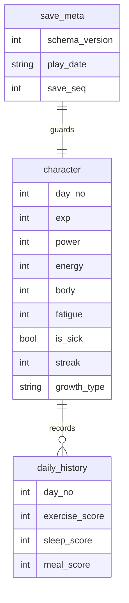
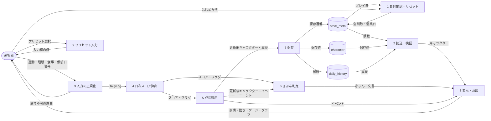
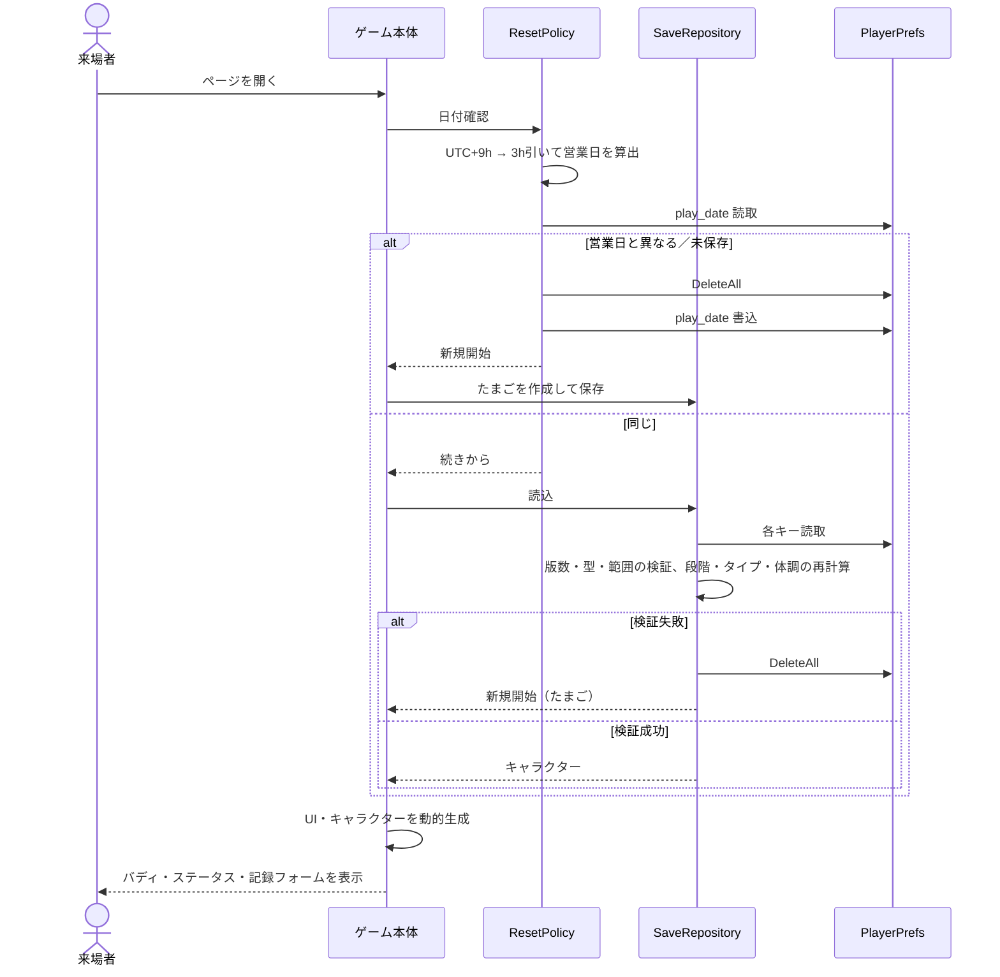
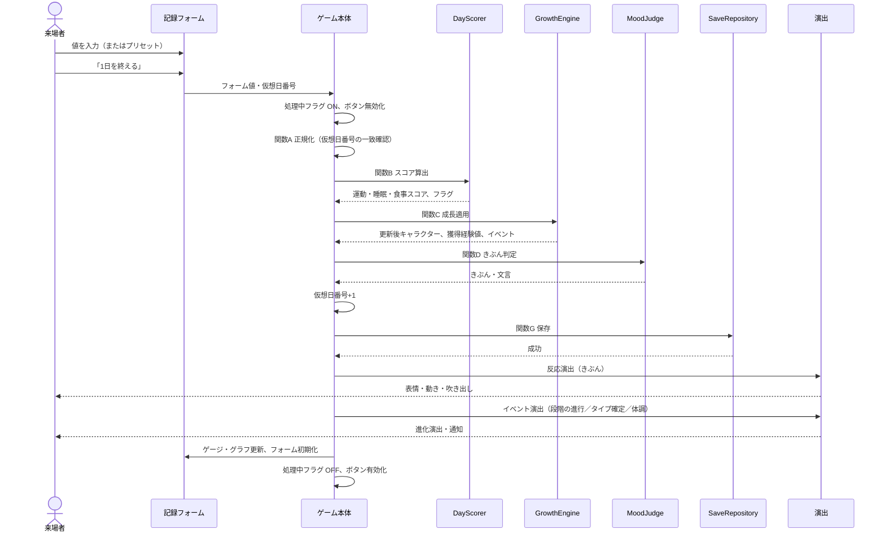
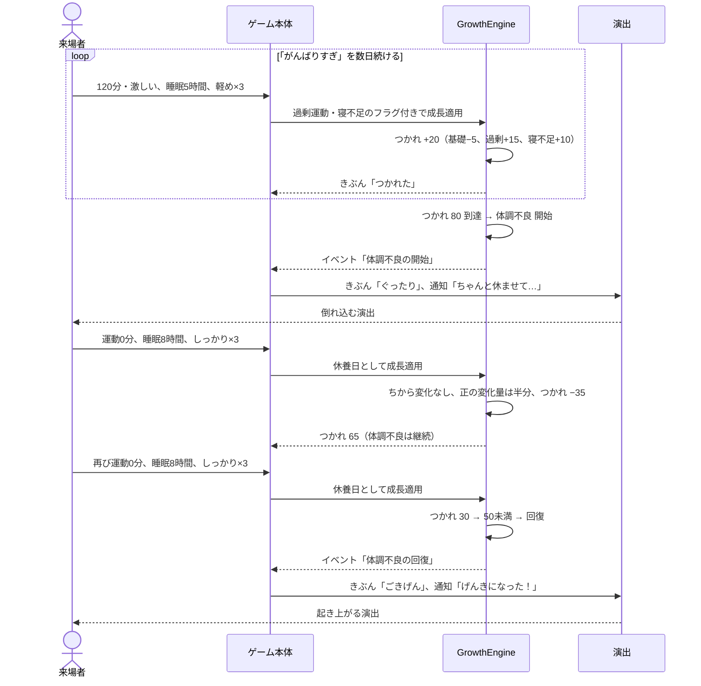
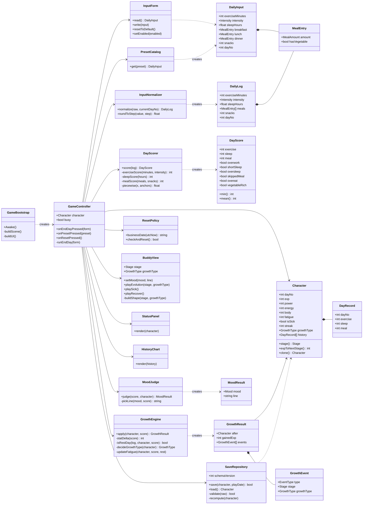
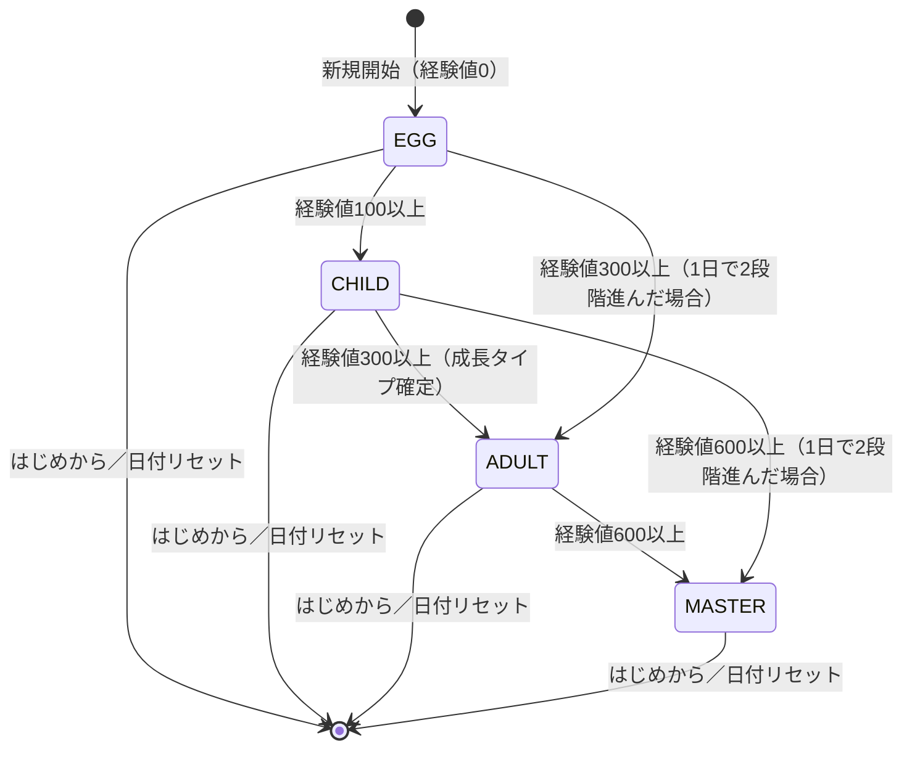
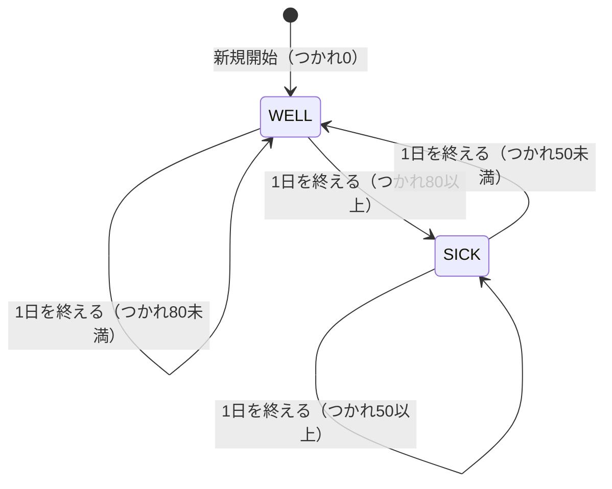
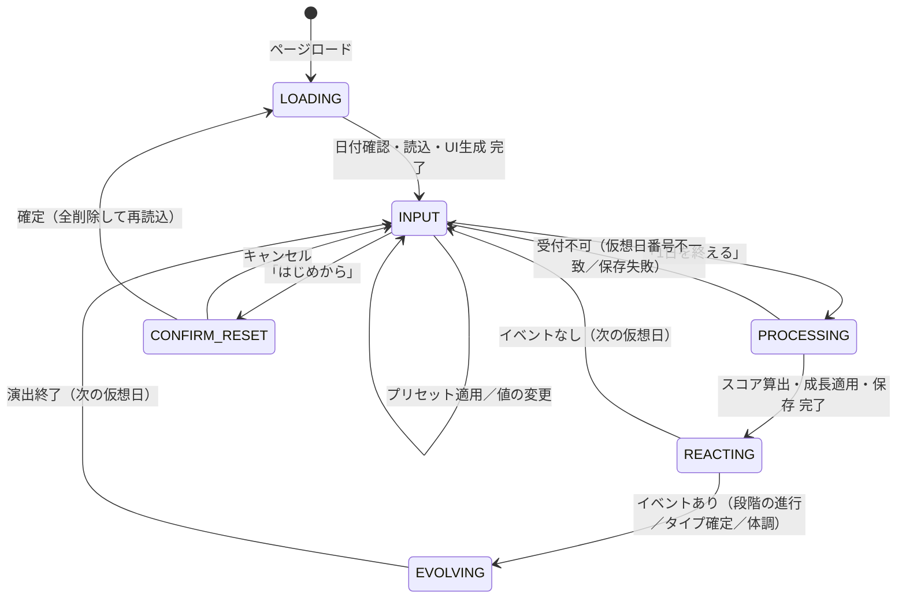
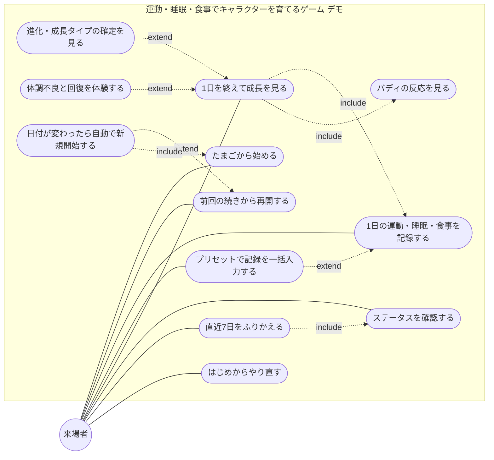

# 運動・睡眠・食事でキャラクターを育てるゲーム — デモ版 設計書

- リポジトリ名：`sukoyaka-buddy-demo`
- 対象エディション：デモ版（アイデアの視覚化）
- プラットフォーム：ゲーム（Unity WebGL、C#、PlayerPrefs、Unity Play）

---

## 1. 概要

### 1.1 課題

「運動をする」「よく眠る」「きちんと食べる」という生活習慣は、効果が出るまでに時間がかかり、日々の実感が薄いために続かない。本ゲームは、その日の運動・睡眠・食事を記録すると、記録の内容に応じてキャラクター「すこやかバディ」がその場で喜んだり疲れたりし、日を重ねるごとに成長・進化する。生活習慣の良し悪しを、数値の羅列ではなくキャラクターの反応と姿の変化として即座に見せ、続ける動機に変える。

### 1.2 デモ版の到達点

来場者が「たまごから始める → 1日分の運動・睡眠・食事を入力する → バディが反応し、ステータスと経験値が増減する → 『1日を終える』を押して次の仮想日へ進む → 数日分を繰り返すと、こども・おとな・たつじんへ段階が進み、育て方に応じた成長タイプに分岐する → がんばりすぎや寝不足が続くと体調を崩し、休むと回復する」という一連の体験を、ブラウザ1つで完結して行える展示物とする。

実生活の1日を待たずに体験できるよう、ゲーム内の「1日」は入力1回分の**仮想日**とし、来場者は数分で数日分の育成を進められる。

### 1.3 ターゲットとプラットフォームの選定理由

- 成果物を直接操作・閲覧するのは来場者（人間）であるため、人間向けプラットフォームに該当する。
- プラットフォームは**ゲーム**として指定されているため、選定は行わず、プロジェクト方針に従いUnity WebGLで構築する。ゲームロジックはC#で実装し、データ保存はPlayerPrefsを使用する。
- キャラクターの表情・動き・進化演出という視覚的なフィードバックが本課題の中核であり、入力に応じて出力が変わる対話的な成果物であるため、電子書籍・動画は不適である。
- AI機能は持たない。スコア算出・成長・進化分岐・体調判定はすべてルールベースで実現できる。
- 実生活の活動量・睡眠を自動取得する機器連携（ウェアラブル・スマホのヘルスケアデータ）は、外部APIに該当するため持たない。すべて来場者の手入力とし、展示用のプリセット入力ボタンで入力の手間を省く。

### 1.4 デモ版の適用制約

| 項目 | 適用内容 |
|---|---|
| 実装方式 | 1 issueのワンショット実装 |
| 外部API | 一切使用しない。ヘルスケアデータ連携・ランキング・共有機能を持たない |
| 認証 | 持たない |
| セッション | サーバを持たないため該当しない。データはブラウザのPlayerPrefs（端末ローカル）に閉じ、他の端末・他の来場者のデータを参照する経路が存在しない |
| DB | PlayerPrefsのみ。ページロード時に日付（JST）を確認し、前回プレイ日と異なれば全データを削除して新しいたまごから始める（4.8節） |
| AI機能 | 持たない。すべてルールベース |
| Bot対策 | サーバへの送信を持たないため該当しない |
| デザイン／測定／保守／監視 | なし。キャラクターは基本図形（円・多角形）の組み合わせと表情パーツで表現し、画像アセットを持たない |
| 個人情報 | 氏名・ニックネーム・生年月日・身長・体重を含め、来場者に関する情報を一切入力させない。入力するのは仮想日の運動・睡眠・食事のみである |
| ビルド | シーン・UI・キャラクターはすべてコードで動的生成し、Unity EditorのGUI操作を不要とする。ビルドは`Unity.exe -batchmode -nographics -executeMethod`でCLI実行する。Unity Playへのアップロードのみ人間が手動で行う |

---

## 2. 機能一覧

| ID | 機能 | 概要 |
|---|---|---|
| F1 | 日付確認とリセット | ページロード時にJSTの営業日を判定し、前回プレイ日と異なればデータを削除して新規開始する |
| F2 | セーブデータの読込・検証 | PlayerPrefsからキャラクターを復元する。欠損・破損・版違いは新規開始として扱う |
| F3 | 仮想日の記録入力 | 運動（時間・強さ）、睡眠（時間）、食事（朝・昼・夕の量と野菜の有無、おやつの回数）を入力する |
| F4 | プリセット入力 | 「元気な一日」「だらけた一日」「がんばりすぎ」「ちょっと不足」の4種で入力欄を一括設定する |
| F5 | 日次スコア算出 | 運動・睡眠・食事それぞれを0〜100のスコアに換算し、過剰・不足のフラグを立てる |
| F6 | 成長適用 | スコアとフラグからステータス・経験値・つかれ・連続日数を更新し、段階と成長タイプを判定する |
| F7 | 反応演出 | その日のきぶん（ごきげん／ふつう／つかれた／ぐったり）に応じた表情・動き・吹き出しを表示する |
| F8 | 進化演出 | 段階が進んだとき、および成長タイプが確定したときに専用の演出を再生する |
| F9 | ステータス表示 | ちから・げんき・からだ・つかれの各ゲージ、段階、成長タイプ、経験値、連続日数を表示する |
| F10 | 直近7日のふりかえり | 直近7仮想日の3スコアを棒グラフで表示する |
| F11 | 1日を終える | 入力を確定して成長を適用し、次の仮想日へ進む。同じ仮想日の二重適用を防ぐ |
| F12 | はじめから | 来場者の操作でデータを削除し、新しいたまごから始める |

---

## 3. 画面・操作仕様

### 3.1 画面構成

単一シーンで構成し、以下の領域をコードで生成する。画面は横1280×縦720を基準とし、ブラウザの表示領域に合わせて等比で拡縮する。

| 領域 | 内容 |
|---|---|
| バディ表示 | キャラクター本体。段階に応じて大きさと形が変わり、きぶんに応じて表情と動きが変わる。吹き出しでひとことを表示する |
| ステータスパネル | 段階名、成長タイプ、仮想日番号、経験値と次の段階までの残り、ちから・げんき・からだ・つかれのゲージ、連続日数 |
| 記録フォーム | 運動時間スライダー（0〜180分、5分刻み）、運動の強さ（軽い／ふつう／激しい）、睡眠時間スライダー（0〜14時間、0.5時間刻み）、朝・昼・夕それぞれの量（抜き／軽め／しっかり／食べすぎ）と野菜の有無、おやつ回数（0〜3回） |
| プリセットボタン | 4種のプリセット |
| 操作ボタン | 「1日を終える」「はじめから」 |
| ふりかえり | 直近7仮想日の運動・睡眠・食事スコアの棒グラフ |

### 3.2 操作の流れ

1. ページロード時に日付確認（F1）とセーブデータの読込（F2）を行い、たまごまたは前回の続きを表示する。
2. 来場者が記録フォームを入力するか、プリセットで一括設定する。
3. 「1日を終える」を押すと、スコア算出（F5）→成長適用（F6）→保存→反応演出（F7）→必要なら進化演出（F8）→ステータス更新（F9）→ふりかえり更新（F10）→仮想日番号の繰り上げ→フォームの初期化の順に処理する。
4. 演出中は「1日を終える」を押せない。演出が終わると次の仮想日の入力を受け付ける。
5. 「はじめから」を押すと確認表示を経てデータを削除し、たまごに戻る。

### 3.3 キャラクター表現

| 段階 | 形 | 大きさ（基準比） |
|---|---|---|
| たまご | 楕円。ひび割れは経験値の進みに応じて増える | 0.6 |
| こども | 丸い体に小さな手足 | 0.8 |
| おとな | 成長タイプに応じた体型（アスリート型：引き締まった体、のんびり型：丸い体と枕、グルメ型：ふくよかな体とスプーン、バランス型：均整の取れた体と葉のマーク） | 1.0 |
| たつじん | おとなの形に光の輪を加える | 1.1 |

| きぶん | 表情 | 動き | 吹き出しの例 |
|---|---|---|---|
| ごきげん | 笑顔 | 跳ねる | 「きょうもいいかんじ！」 |
| ふつう | 通常 | ゆっくり揺れる | 「まあまあかな」 |
| つかれた | 半目・汗 | 揺れが小さい | 「ちょっとやりすぎたかも…」 |
| ぐったり | 目を閉じる | 倒れ込む | 「もう動けない…」「ちゃんと休ませて…」 |

色のみで状態を区別せず、表情・動き・吹き出しの文言でも区別する。

---

## 4. ロジック仕様

すべてルールベースで、外部との通信を持たない。数値定数は4.9節にまとめる。

### 4.1 関数A：入力の正規化（normalizeDailyInput）

**入力**：記録フォームの値（運動時間、運動の強さ、睡眠時間、朝・昼・夕の量と野菜の有無、おやつ回数）、仮想日番号。

**出力**：正規化済みの日次記録（DailyLog）。受け付けられない場合はその理由。

**手順**

1. 運動時間は0〜180の整数とし、5の倍数に丸める（最も近い倍数、同距離は切り上げ）。範囲外・数値でない値は既定値0とし、入力欄をその値に戻す。
2. 運動の強さは「軽い／ふつう／激しい」のいずれかとし、それ以外は「ふつう」とする。運動時間が0のとき、強さは判定に用いない。
3. 睡眠時間は0〜14の0.5刻みとし、0.5の倍数でない値は最も近い倍数に丸める（同距離は切り上げ）。範囲外・数値でない値は既定値7とし、入力欄をその値に戻す。
4. 朝・昼・夕の量はそれぞれ「抜き／軽め／しっかり／食べすぎ」のいずれかとし、それ以外は「軽め」とする。野菜の有無は真偽値とし、量が「抜き」のときは野菜の有無を偽に強制する（食べていない食事に野菜は付かない）。
5. おやつ回数は0〜3の整数とし、範囲外・数値でない値は0とする。
6. 仮想日番号がキャラクターの現在の仮想日番号と一致しない場合は「この日はすでに終わっています」として受け付けない（二重適用の防止）。
7. 以上を満たした値をDailyLogとして返す。

### 4.2 関数B：日次スコア算出（scoreDay）

**入力**：DailyLog。

**出力**：運動スコア・睡眠スコア・食事スコア（各0〜100の整数）と、フラグ（過剰運動、寝不足、寝すぎ、欠食、食べすぎ、野菜たっぷり）。

**設計原則**

- スコアは「多いほど良い」ではなく「適量が最も良い」とする。運動のやりすぎ、寝すぎ、食べすぎはいずれもスコアが下がる。
- 折れ線（区間ごとの直線補間）で定義し、隣り合う入力値でスコアが飛び跳ねないようにする。
- フラグはスコアとは別に立てる。スコアがそれほど下がらなくても、体に負担がかかる行動（激しい運動の長時間実施など）はフラグで捉え、関数Cのつかれに反映する。

**運動スコア**

1. 運動量＝運動時間×強さ係数（軽い0.6、ふつう1.0、激しい1.4）を求める。
2. 運動量を次の折れ線でスコアに換算し、四捨五入する。

| 運動量 | 0 | 30 | 60 | 120 | 240以上 |
|---|---|---|---|---|---|
| スコア | 0 | 70 | 100 | 100 | 50 |

3. 運動量が120を超えるとき「過剰運動」フラグを立てる。

**睡眠スコア**

1. 睡眠時間を次の折れ線でスコアに換算し、四捨五入する。

| 時間 | 0 | 4 | 6 | 7 | 7.5〜9 | 10 | 11 | 12以上 |
|---|---|---|---|---|---|---|---|---|
| スコア | 0 | 20 | 60 | 90 | 100 | 80 | 60 | 40 |

2. 睡眠時間が6未満のとき「寝不足」、10を超えるとき「寝すぎ」フラグを立てる。

**食事スコア**

1. 朝・昼・夕それぞれの量を点数化する（抜き0、軽め20、しっかり30、食べすぎ15）。量が「抜き」でない食事に野菜があれば5点を加える。
2. 3食の合計から、おやつ2回目以降1回につき5点を引く（1回目は引かない）。
3. 0〜100に収める。
4. いずれかの食事が「抜き」のとき「欠食」フラグ、いずれかの食事が「食べすぎ」またはおやつが3回のとき「食べすぎ」フラグ、3食すべてが「抜き」以外かつ野菜ありのとき「野菜たっぷり」フラグを立てる。

### 4.3 関数C：成長適用（applyGrowth）

**入力**：キャラクター（Character）、スコアとフラグ。

**出力**：更新後のキャラクター、その日の獲得経験値、発生したイベントの一覧（段階の進行、成長タイプの確定、体調不良の開始・回復、連続日数の更新）。

**設計原則**

- 良い1日は3つのステータスを少しずつ伸ばし、悪い1日は伸びないか少し下げる。1日の変化幅を小さく保ち、数日の積み重ねで差が見えるようにする。
- 3つのバランスが取れた日を続けると経験値にボーナスが付き、偏った育て方より早く段階が進む。
- やりすぎは「つかれ」として蓄積し、閾値を超えると体調不良になって成長が鈍る。休むと回復する。
- 段階は経験値のみから求める派生値とし、保存値と食い違っても経験値から再計算する。
- 成長タイプは「おとな」に初めて達した日のステータスで一度だけ確定し、以後変えない。

**手順**

1. **休養日の判定**：運動時間が0、つかれが40以上、睡眠スコアが60以上のすべてを満たすとき、その日を休養日とする。
2. **ステータス変化量の算出**：スコアから共通の変化量を求める。

| スコア | 80以上 | 60〜79 | 40〜59 | 20〜39 | 20未満 |
|---|---|---|---|---|---|
| 変化量 | +6 | +4 | +2 | 0 | −3 |

   - ちから：運動スコアから求める。ただし運動スコアが20未満のときは−3ではなく−2とし、休養日のときは0とする。
   - げんき：睡眠スコアから求める。寝すぎのときは変化量を+2以下に抑える。過剰運動のときはさらに−2する。
   - からだ：食事スコアから求める。食べすぎのときはさらに−2し、野菜たっぷりのときはさらに+1する。
3. **体調不良中の減衰**：キャラクターが体調不良のとき、正の変化量を半分（切り捨て）にする。負の変化量はそのまま適用する。
4. **ステータスの更新**：3つのステータスに変化量を加え、それぞれ0〜100に収める。
5. **連続日数の更新**：3スコアがすべて60以上の日を「バランスの日」とし、連続日数を1増やす。そうでない日は0に戻す。
6. **獲得経験値の算出**：3スコアの平均を四捨五入した値を基本値とする。連続日数が3以上のとき1.5倍して四捨五入する。体調不良のとき半分（切り捨て）にする。
7. **経験値と段階の更新**：経験値に獲得経験値を加える（上限9999）。更新前後の段階を経験値の閾値（たまご0〜99、こども100〜299、おとな300〜599、たつじん600以上）から求め、段階が進んでいれば「段階の進行」イベントを出す。1日で2つ以上進んだ場合も、到達した段階を1回のイベントとして出す。
8. **成長タイプの確定**：更新後の段階がおとな以上で、かつ成長タイプが未確定のとき、この時点の3ステータスで確定する。最大値と2番目の差が5以下ならバランス型、そうでなければ最大のステータスに応じてちから→アスリート型、げんき→のんびり型、からだ→グルメ型とする。「成長タイプの確定」イベントを出す。
9. **つかれの更新**：基礎回復−5に、過剰運動+15、寝不足+10、欠食+5、睡眠スコア90以上−15、休養日−15を加えた値をつかれに加え、0〜100に収める。
10. **体調の判定**：体調不良でないときつかれが80以上になれば体調不良とし「体調不良の開始」イベントを出す。体調不良のときつかれが50未満になれば回復とし「体調不良の回復」イベントを出す。開始と回復の閾値に差を設け、境界付近で毎日入れ替わることを防ぐ。
11. 直近7日の履歴に今日の3スコアを追加し、8日以上になれば最も古い日を捨てる。

### 4.4 関数D：きぶんの判定（judgeMood）

**入力**：スコアとフラグ、更新後のキャラクター。

**出力**：きぶん（ごきげん／ふつう／つかれた／ぐったり）と吹き出しの文言。

**手順**：以下を上から順に評価し、最初に該当したものを採用する。

| 優先 | 条件 | きぶん |
|---|---|---|
| 1 | 体調不良である | ぐったり |
| 2 | 3スコアの最小値が30未満 | ぐったり |
| 3 | 過剰運動または寝不足のフラグがある | つかれた |
| 4 | 3スコアの最小値が60以上 | ごきげん |
| 5 | 上記以外 | ふつう |

吹き出しの文言は、きぶんごとに複数用意した定型文から、最も低いスコアの項目（運動／睡眠／食事）に対応するものを選ぶ。3スコアが同点の場合は運動→睡眠→食事の順で優先する。

### 4.5 関数E：1日を終える（endDay）

**入力**：記録フォームの値、キャラクター。

**出力**：演出の指示（きぶん、イベント一覧）と次の仮想日番号。

**手順**

1. 処理中フラグが立っていれば何もしない。立てる。
2. 関数Aで正規化する。受け付けられない場合は理由を表示し、処理中フラグを下ろして終了する。
3. 関数B、関数C、関数Dの順に呼ぶ。
4. キャラクターの仮想日番号を1増やし、関数Gで保存する。保存に失敗した場合はキャラクターを保存前の状態に戻し、「保存できませんでした」と表示して終了する。
5. 反応演出、段階の進行・成長タイプの確定の演出、体調不良の開始・回復の通知を順に再生する。
6. ステータスパネルとふりかえりを更新し、記録フォームを既定値（運動0分・ふつう、睡眠7時間、3食「軽め」・野菜なし、おやつ0回）に戻す。
7. 処理中フラグを下ろす。

### 4.6 関数F：プリセット入力（applyPreset）

| プリセット | 運動 | 睡眠 | 朝／昼／夕 | おやつ |
|---|---|---|---|---|
| 元気な一日 | 45分・ふつう | 8時間 | しっかり・野菜あり × 3 | 0回 |
| だらけた一日 | 0分 | 11時間 | 抜き／食べすぎ／食べすぎ、野菜なし | 3回 |
| がんばりすぎ | 120分・激しい | 5時間 | 軽め・野菜なし × 3 | 0回 |
| ちょっと不足 | 15分・軽い | 6時間 | 軽め・野菜なし／しっかり・野菜あり／軽め・野菜なし | 1回 |

プリセットは入力欄の値を置き換えるだけで、「1日を終える」は別途押す。来場者はプリセット適用後に個別の値を変えられる。

### 4.7 関数G：保存と読込（saveCharacter / loadCharacter）

**保存**

1. スキーマ版数、プレイ日（営業日）、仮想日番号、経験値、ちから、げんき、からだ、つかれ、体調不良の有無、連続日数、成長タイプ、直近7日の履歴をそれぞれのキーに書き込む。
2. 最後に保存通番を1増やして書き込み、PlayerPrefsのSaveを呼ぶ。
3. Saveが例外を返した場合は失敗として呼び出し元に伝える。

**読込**

1. スキーマ版数のキーがない、または現在の版数と異なる場合は新規開始とする。
2. 各キーを読み、数値として解釈できない、または4.9節の範囲を外れる値が1つでもあれば新規開始とする。
3. 段階は保存せず、経験値から求める。成長タイプが未確定で段階がおとな以上の場合は、読込時点のステータスで関数Cの手順8と同じ規則により確定する。
4. 体調不良の有無とつかれの整合を確認し、体調不良でないのにつかれが80以上、または体調不良なのにつかれが50未満の場合は、つかれの値を正として体調不良の有無を直す。
5. 履歴は7日を超える分を古い側から捨てる。
6. 新規開始のときは、たまご（仮想日1、経験値0、ちから・げんき・からだ各10、つかれ0、連続日数0、成長タイプ未確定、履歴なし）を作り、保存する。

### 4.8 関数H：日付確認とリセット（checkDailyReset）

1. 現在時刻をUTCで取得し、9時間を加えてJSTとする（ブラウザのタイムゾーン設定に依存しない）。
2. JSTから3時間を引いた日付を営業日とする（JST 03:00を日の境とし、深夜のプレイを前日として扱う）。
3. 保存されているプレイ日と営業日を比較し、異なる（または保存されていない）場合はPlayerPrefsを全削除し、営業日をプレイ日として書き込んで新規開始とする。
4. 同じ場合は関数Gの読込を行う。
5. 日付確認はページロード時のみ行う。プレイ中に営業日が変わっても、その場ではリセットしない（次のページロード時に反映する）。

### 4.9 定数一覧（デモ版の既定値）

| 定数 | 値 | 用途 |
|---|---|---|
| 運動時間の範囲・刻み | 0〜180分、5分 | 関数A |
| 強さ係数 | 軽い0.6、ふつう1.0、激しい1.4 | 関数B |
| 運動スコアの折れ線 | 運動量0→0、30→70、60→100、120→100、240→50 | 関数B |
| 過剰運動の閾値 | 運動量120超 | 関数B |
| 睡眠時間の範囲・刻み | 0〜14時間、0.5時間 | 関数A |
| 睡眠スコアの折れ線 | 0→0、4→20、6→60、7→90、7.5→100、9→100、10→80、11→60、12→40 | 関数B |
| 寝不足／寝すぎの閾値 | 6時間未満／10時間超 | 関数B |
| 食事の点数 | 抜き0、軽め20、しっかり30、食べすぎ15、野菜+5 | 関数B |
| おやつの減点 | 2回目以降1回につき−5 | 関数B |
| ステータス変化量 | 80以上+6、60〜79+4、40〜59+2、20〜39 0、20未満−3（ちからの20未満は−2） | 関数C |
| 寝すぎ時のげんき上限 | +2 | 関数C |
| 過剰運動のげんき減 | −2 | 関数C |
| 食べすぎのからだ減／野菜たっぷりのからだ増 | −2／+1 | 関数C |
| バランスの日の条件 | 3スコアすべて60以上 | 関数C |
| 連続ボーナス | 連続3日以上で経験値1.5倍 | 関数C |
| 体調不良中の減衰 | 正の変化量と経験値を半分（切り捨て） | 関数C |
| 段階の閾値 | こども100、おとな300、たつじん600 | 関数C |
| 経験値の上限 | 9999 | 関数C |
| バランス型の判定幅 | 最大と2番目の差が5以下 | 関数C |
| 休養日の条件 | 運動0分、つかれ40以上、睡眠スコア60以上 | 関数C |
| つかれの変動 | 基礎−5、過剰運動+15、寝不足+10、欠食+5、睡眠スコア90以上−15、休養日−15 | 関数C |
| 体調不良の開始／回復 | つかれ80以上／50未満 | 関数C |
| 初期ステータス | ちから・げんき・からだ各10 | 関数G |
| 履歴の日数 | 7 | 関数C・G |
| 営業日の境 | JST 03:00 | 関数H |
| 基準解像度 | 1280×720 | 3章 |

---

## 5. データ仕様

- 保存先はPlayerPrefsのみで、キー・値の形式で保持する。テーブル構造は持たないが、論理的には「キャラクター」「日次履歴」「保存メタ」の3つのまとまりからなる。
- 段階・きぶんは派生値であり保存しない。段階は経験値から、きぶんはその日のスコアから求める。
- 個人を特定できる項目は持たない。
- キー名にはスキーマ版数を含めず、版数は独立したキーで持つ。

| まとまり | キー | 型 | 範囲・意味 |
|---|---|---|---|
| 保存メタ | schema_version | 整数 | 現在の版数と一致すること |
| 保存メタ | play_date | 文字列 | 営業日（yyyy-MM-dd） |
| 保存メタ | save_seq | 整数 | 保存通番。書き込みの最後に更新する |
| キャラクター | day_no | 整数 | 仮想日番号（1以上） |
| キャラクター | exp | 整数 | 経験値（0〜9999） |
| キャラクター | power | 整数 | ちから（0〜100） |
| キャラクター | energy | 整数 | げんき（0〜100） |
| キャラクター | body | 整数 | からだ（0〜100） |
| キャラクター | fatigue | 整数 | つかれ（0〜100） |
| キャラクター | is_sick | 整数 | 体調不良の有無（0／1） |
| キャラクター | streak | 整数 | 連続日数（0以上） |
| キャラクター | growth_type | 文字列 | 未確定／アスリート型／のんびり型／グルメ型／バランス型 |
| 日次履歴 | history | 文字列 | 直近7日の「仮想日番号,運動,睡眠,食事」を日ごとに区切って連結した文字列 |

---

## 6. ER図

PlayerPrefsはキー・値のストアであるため物理的なテーブルは持たない。以下は論理的なまとまりと関係を示す。



---

## 7. DFD



---

## 8. シーケンス図

### 8.1 ページロードから表示まで



### 8.2 1日を終える（通常の成長）



### 8.3 がんばりすぎから体調不良、休養による回復



---

## 9. クラス図



---

## 10. 状態遷移図

### 10.1 キャラクターの段階



段階は経験値から一方向にのみ進み、経験値が減ることはないため後退しない。

### 10.2 体調



体調不良中は正のステータス変化量と獲得経験値が半分になり、きぶんは常に「ぐったり」となる。

### 10.3 ゲーム本体（1仮想日のサイクル）



PROCESSING・REACTING・EVOLVINGの間は「1日を終える」「はじめから」を受け付けない。

---

## 11. ユースケース図



---

## 12. 非機能要件と制約

### 12.1 ロジック設計の原則

- スコアは「適量が最も良い」折れ線で定義し、やりすぎ（長時間の激しい運動、寝すぎ、食べすぎ）で必ず下がる。単調増加のスコアを用いない。
- スコアと体への負担は別に扱う。スコアがほとんど下がらない範囲でも、過剰運動・寝不足・欠食はフラグとしてつかれに蓄積する。
- 休養日は「運動しなかった日」ではなく「つかれているときに運動を休み、十分に眠った日」に限る。睡眠も食事も欠いた日を休養として扱わない。
- 体調不良の開始（80）と回復（50）に差を設け、境界付近での毎日の入れ替わりを防ぐ。
- 負の変化量は体調不良中でも減衰させない（休まなければ悪化する、という因果を崩さない）。
- 段階・きぶんは派生値とし、保存値に依存しない。成長タイプは一度確定したら変えない。
- 連続ボーナスにより1日で段階を2つ進む場合があるため、段階の進行は「更新前後の段階の比較」で判定し、境界通過の回数で判定しない。

### 12.2 入力の堅牢性

- すべての入力はUI側で範囲と刻みを制限したうえで、ロジック側でも正規化する。UIの制限を信頼しない。
- 数値として解釈できない値・範囲外の値は既定値に置き換え、入力欄にも反映して来場者に見せる。エラーで処理を止めない。
- 仮想日番号を入力に含め、同じ仮想日の二重適用を拒否する。処理中はボタンを無効化し、拒否は二重の防御とする。

### 12.3 永続化の堅牢性

- 読込時に版数・型・範囲をすべて検証し、1項目でも不正なら全削除して新規開始とする。部分的に復元しない。
- 派生値（段階・体調の整合・成長タイプの未確定）は読込時に再計算し、保存値と食い違っても経験値・つかれ・ステータスを正とする。
- 保存はすべてのキーを書いてからSaveを呼び、失敗時はキャラクターを保存前の状態に戻す。
- 日付判定はUTCに9時間を加えたJSTで行い、ブラウザのタイムゾーン設定に依存しない。

### 12.4 操作性

- 来場者が数分で数日分を体験できるよう、「1日」は仮想日とし、演出は各3秒以内に収める。
- プリセットで典型的な4パターンを1タップで入力でき、説明なしでも「良い日」と「悪い日」の違いを体験できる。
- きぶん・段階・体調は色だけでなく表情・形・文言で区別する。
- 拒否・失敗（同じ日の二重適用、保存失敗）は吹き出しで理由を表示する。

### 12.5 データと個人情報

- 来場者に関する情報を一切入力させず、保存するのは仮想日の記録から導いた数値のみである。
- データは端末のPlayerPrefsに閉じ、送信・共有の経路を持たない。
- ページロード時にJST 03:00境界の営業日を確認し、前回と異なれば全削除する。展示会場で来場者が入れ替わる日ごとに、たまごから始まる状態に戻る。

### 12.6 ビルドと配信

- シーン・UI・キャラクターの形状・アニメーションはすべてコードで生成し、プレハブ・シーンファイル・画像アセットに依存しない。
- ビルドは`Unity.exe -batchmode -nographics -executeMethod Build.WebGL`でCLI実行する。
- Unity Playへのアップロードのみ人間が手動で行う。

### 12.7 リポジトリ構成

```
sukoyaka-buddy-demo/
├── Assets/
│   ├── Scripts/
│   │   ├── Boot/          # GameBootstrap（シーン・UIの動的生成）
│   │   ├── Core/          # InputNormalizer・DayScorer・GrowthEngine・MoodJudge・PresetCatalog
│   │   ├── Model/         # Character・DailyLog・DayScore・GrowthResult
│   │   ├── Persistence/   # SaveRepository・ResetPolicy
│   │   ├── View/          # BuddyView・StatusPanel・HistoryChart・InputForm
│   │   └── Editor/        # Build（CLIビルド用エントリ）
│   └── Tests/             # EditModeテスト（Core・Persistenceの規則検証）
├── ProjectSettings/
├── docs/
│   └── spec.md            # 本書
└── README.md
```

---

## 13. 用語

| 用語 | 定義 |
|---|---|
| すこやかバディ（バディ） | 来場者が育てるキャラクター |
| 仮想日 | 記録フォーム1回分をゲーム内の1日として扱う単位。実際の日付と連動しない |
| 営業日 | JSTから3時間を引いた日付。ページロード時のリセット判定に用いる |
| 運動量 | 運動時間×強さ係数。運動スコアと過剰運動の判定に用いる |
| スコア | 運動・睡眠・食事それぞれの0〜100の評価。適量で最大となる |
| フラグ | 過剰運動・寝不足・寝すぎ・欠食・食べすぎ・野菜たっぷり。スコアとは別に立て、つかれとステータスの補正に用いる |
| ステータス | ちから（運動）・げんき（睡眠）・からだ（食事）の3値。各0〜100 |
| つかれ | 体への負担の蓄積。0〜100。80以上で体調不良、50未満で回復 |
| 体調不良 | つかれが蓄積した状態。正のステータス変化量と獲得経験値が半分になる |
| 休養日 | つかれが40以上のときに運動を休み、睡眠スコア60以上を満たした日。ちからが下がらず、つかれが大きく減る |
| バランスの日 | 3スコアがすべて60以上の日。連続日数の対象 |
| 連続日数 | バランスの日が続いた日数。3日以上で経験値ボーナス |
| 段階 | たまご・こども・おとな・たつじん。経験値から求める派生値 |
| 成長タイプ | おとなに達した日のステータスで確定する型（アスリート型・のんびり型・グルメ型・バランス型） |
| きぶん | その日の反応（ごきげん・ふつう・つかれた・ぐったり）。保存しない |
| プリセット | 記録フォームを一括設定する展示用の定型入力 |
